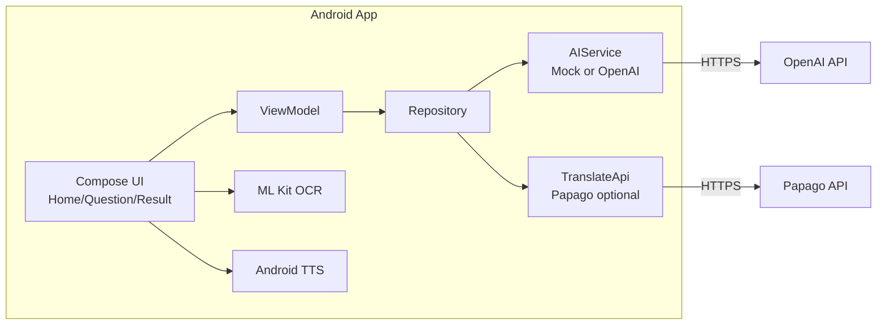

# BilingualBuddy — 다문화/이주배경 학생을 위한 이중언어 학습 도우미(Android)

OCR로 읽은 텍스트(숙제/공지/교과 내용)를 **요약·해설**하고, 필요 시 **번역/TTS**로 전달하는 Android 앱 MVP입니다. (기본값: **Mock 모드**로 API 키 없이 실행)

## 데모

- **로컬 실행**: 아래 [빠른 시작(Quick Start)](#빠른-시작quick-start) 참고
- **이미지**


## 문제 정의(Why) / 목표(Goal)

- **Why**: 학교 안내/숙제/교과 내용을 이해하는 과정에서 언어 장벽이 생기면 학습 참여와 가정-학교 소통이 끊깁니다.
- **Goal**: 사진/텍스트 입력 → (1) 모국어 요약 (2) 한국어 설명 (3) 발음 가이드 형태로 결과를 빠르게 제공하고, **API 키가 없어도 UI/흐름을 재현**할 수 있게 합니다.

## 주요 기능(Features)

- **OCR 입력**: 이미지에서 텍스트 추출(ML Kit 한국어 인식)
- **질문/답변 플로우**: 질문 입력 → 로딩/에러 처리 → 결과(3파트) 표시
- **AI 응답 포맷**: `[베트남어 요약] / [한국어 설명] / [발음]` 분리 표시(실 API 모드)
- **MockAIService**: API 키 없이 예시 답변으로 동작(기본값)
- **번역(선택)**: Papago NMT 연동(키 설정 시)
- **TTS(선택)**: 결과를 음성으로 읽기(Android TTS)

## 기술 스택

- **Frontend(Android)**: Kotlin, Jetpack Compose, Material 3, Navigation Compose
- **Architecture**: MVVM, Repository, Hilt(DI), Coroutines/Flow
- **Networking**: OkHttp, org.json
- **ML/OCR**: ML Kit Text Recognition (Korean)
- **External APIs(선택)**: OpenAI Chat Completions, Naver Papago NMT

## 시스템 구성도(Architecture)



## 빠른 시작(Quick Start)

### 요구사항

- **Android Studio**: Hedgehog(2023.1.1) 이상 권장
- **JDK**: 17 (Android Studio Embedded JDK 사용 가능)
- **Android SDK**: compileSdk 34 / minSdk 26

### 로컬 실행

1) 레포 클론

```bash
git clone <REPO_URL>
cd "BilingualBuddy"
```

2) Android Studio에서 프로젝트 열기 → Gradle Sync

3) 에뮬레이터/실기기 선택 후 Run

- 기본값은 **Mock 모드**입니다. (API 키 없이 동작)

#### (선택) 실 API 모드로 실행

- `local.properties`에 아래 키를 추가합니다. (`local.properties`는 git에 커밋되지 않습니다)

```properties
OPENAI_API_KEY=sk_test_your_key
PAPAGO_CLIENT_ID=naver_client_id
PAPAGO_CLIENT_SECRET=naver_client_secret
```

- `app/src/main/java/com/example/bilingualbuddy/di/AppModule.kt`에서 주입 대상을 변경합니다.
  - 기본: `return MockAIService()`
  - 실 API: `return OpenAiService()`

### Docker 실행

- 해당 없음 (Android 단일 앱 프로젝트)

### 테스트(있을 때)

```bash
.\gradlew.bat test
```

## 환경변수(.env.example)

> 실제 프로젝트에서는 `local.properties`를 사용합니다. 아래는 **키 이름/의미/가짜 예시**만 정리한 표입니다.

| 키 | 설명 | 예시(가짜 값) |
|---|---|---|
| `OPENAI_API_KEY` | OpenAI API 호출용(실 API 모드에서만 필요) | `sk_test_1234567890` |
| `PAPAGO_CLIENT_ID` | Papago 번역 Client ID(선택) | `papago_client_id_test` |
| `PAPAGO_CLIENT_SECRET` | Papago 번역 Client Secret(선택) | `papago_client_secret_test` |

## 폴더 구조(간단)

```
app/src/main/java/com/example/bilingualbuddy/
├── api/                # AI/번역 API, 서비스 인터페이스
├── data/repository/    # Repository 구현
├── di/                 # Hilt DI 모듈
├── model/              # 데이터 모델
├── navigation/         # Navigation
├── ui/                 # 화면/테마/ViewModel
└── util/               # OCR/TTS/Result 등 유틸
```

## 구현 범위(요약)

- **End-to-end 플로우**: 질문 입력 → OCR → AI 호출/Mock → 결과 표시
- **아키텍처**: MVVM + Repository + Hilt로 의존성/레이어 분리
- **Mock 기본값**: API 키 없이도 화면/상태 전이 재현 가능
- **외부 API(선택)**: OpenAI 호출/응답 파싱 및 HTTP 에러(401/403/429 등) 메시지 정리
- **OCR 처리**: ML Kit 한국어 인식 옵션 + 빈 결과/예외 처리
- **테스트(일부)**: ViewModel/Repository 단위 테스트

## 트러블슈팅/의사결정

- **API 키/크레딧/모델 접근 이슈** → UI 개발이 막히지 않도록 `MockAIService`로 의존성을 격리하고, DI에서 손쉽게 전환 가능하게 구성
- **OCR 인식 품질/실패 케이스** → 한국어 인식 전용 옵션 사용 + 빈 결과/예외를 `Result`로 표준화해 사용자 메시지로 변환
- **네비게이션/뒤로가기 안정성** → Navigation 스택을 명확히 하고, 결과 화면 이후 안전한 복귀 흐름을 정리

## TODO / 향후 개선 사항

- **DI 전환 개선**: 빌드 타입/플래그로 `MockAIService` ↔ `OpenAiService` 자동 전환(코드 수정 없이)
- **프롬프트/출력 안정화**: 섹션 누락/형식 깨짐에 대한 복구 로직 강화 및 구조화된 응답 포맷(JSON 등) 검토
- **OCR UX 개선**: 크롭/회전/대비 보정, 인식 결과 편집 UI, 실패 시 재시도 가이드
- **테스트 확대**: OCR/네트워크 모킹 기반의 통합 테스트 및 UI 테스트 추가
- **보안/배포**: 키 관리(로컬/CI) 정리, 릴리즈 빌드에서의 로깅/에러 메시지 정책 정교화
